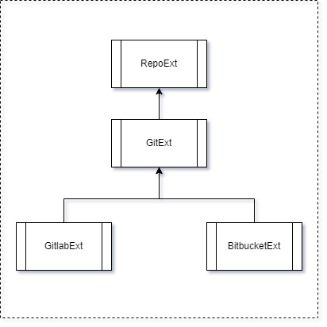

::## Auto Merge

This script produces auto merge with two branches.  
This script run from CI/CD pipeline and get environment variables from GitLab.  
This script run upd_gradle_versions functional.

User settings are contained in config.py.

##### To run the script: 

> main.py --system=bitbucket --branch_from=[branch] --branch_to=[branch] --rm_snapshot=True

##### Parameters:
`--system/-s - version control system (gitlab, bitbucket)`  
`--branch_from/-f - source branch (ex: test10, develop11, release15)`  
`--branch_to/-t - destination branch (ex: test10, develop11, release15)`  
`--remove_snapshot/-r - can be True/False. Default: False`  
`--help/-h - info about parameters`

##### Structure  
There is following structure of the classes:  

